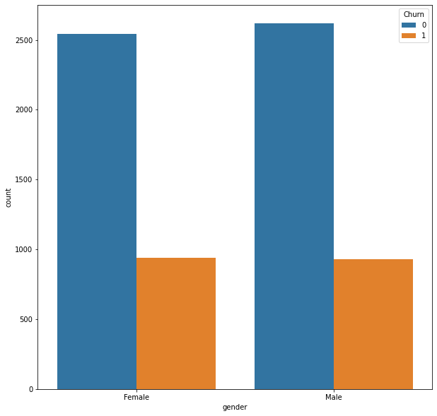
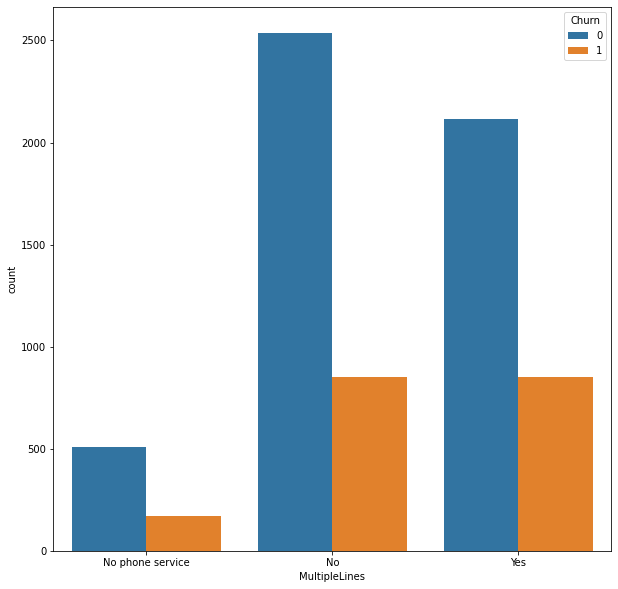

# Churn Prediction: Retaining Customers with Logistic Regression

This project involves data preprocessing, exploratory data analysis, and training a logistic regression model to predict customer churn. We'll use Python libraries like Pandas, NumPy, Seaborn, and Scikit-learn to accomplish this.

## Table of Contents

- [Introduction](#introduction)
- [Process](#process)
  - [Data Loading and Initial Exploration](#import)
  - [Data Preprocessing](#model)
  - [Exploratory Data Analysis (EDA)](#cm)
  - [Data Scaling and Visualization](#interpret)
  - [Model Training and Evaluation](#train)

## [Introduction](#introduction)

**Objective:** The project aims to predict customer churn based on various customer attributes and services subscribed to. Churn refers to customers who have left within the last month. Utilizing logistic regression, the goal is to develop a model that predicts customer churn, aiding in the development of focused customer retention programs.

**Dataset:** The dataset contains diverse information about customers, including demographics, account details, and services subscribed to.

## [Process](#process)

### [Data Loading and Initial Exploration](#import)

- We start by importing necessary libraries and loading the dataset using Pandas.
- We display the first 5 rows of the dataset and get basic information like column names, data types, and non-null counts for each column.

```python
import pandas as pd
import numpy as np

from sklearn.preprocessing import MinMaxScaler
from sklearn.model_selection import train_test_split
from sklearn.linear_model import LogisticRegression
from sklearn.metrics import confusion_matrix, ConfusionMatrixDisplay


csv_path = r'..\WA_Fn-UseC_-Telco-Customer-Churn.csv'
df_data = pd.read_csv(csv_path)

df_data.head(5)
df_data.info()
```


### [Data Preprocessing](#model)

- We handle missing values by converting 'TotalCharges' to numeric and dropping rows with missing values.
- We drop the 'customerID' column as it's not relevant for prediction.
- We convert 'Churn' to numerical values (1 for 'Yes' and 0 for 'No').
- We perform one-hot encoding on categorical features using pd.get_dummies().

```python
df_data.TotalCharges = pd.to_numeric(df_data.TotalCharges, errors='coerce')
df_data.dropna(inplace=True)
df_data.drop('customerID', axis=1, inplace=True)
df_data['Churn'].replace(to_replace=['Yes', 'No'], value=[1, 0], inplace=True)

df_data_preprocessing = pd.get_dummies(df_data)
```

### [Exploratory Data Analysis (EDA)](#cm)

- We visualize the correlation of each feature with 'Churn' to understand their influence on customer churn.
- This step helps in identifying features that might play a significant role in predicting churn.

```python
fig = plt.figure(figsize=(15, 9))
df_data_preprocessing.corr()['Churn'].sort_values(ascending=True).plot(kind='bar')
plt.show()
```


### [Data Scaling and Visualization](#interpret)

- We use Min-Max scaling to scale the features between 0 and 1, ensuring uniform feature scaling for the logistic regression model.
- We visualize the distribution of customers with respect to 'gender' and other categorical features.
- The pair plot helps visualize relationships between numerical features and 'Churn'.

```python
scaler = MinMaxScaler()
df_data_preprocessing_scaled = scaler.fit_transform(df_data_preprocessing)
df_data_preprocessing_scaled = pd.DataFrame(df_data_preprocessing_scaled)
df_data_preprocessing_scaled.columns = df_data_preprocessing.columns

sns.countplot(data=df_data, x='gender', hue='Churn')
```


```python
def plot_categorical(column):
    plt.figure(figsize=(5, 5))
    sns.countplot(data=df_data, x=column, hue='Churn')
    plt.show()

column_cat = df_data.select_dtypes(include='object').columns

for _ in column_cat:
    plot_categorical(_)
```







```python
fig = plt.figure(figsize=(10, 10))
sns.pairplot(data=df_data, hue='Churn')
plt.show()
```


### [Model Training and Evaluation](#train)

- We split the data into training and testing sets, then train a logistic regression model using the training data.
- We make predictions on the test set and evaluate the model's accuracy using metrics.accuracy_score.
- We display the model's coefficients to understand feature importance.
- Finally, we visualize the confusion matrix using ConfusionMatrixDisplay to evaluate the model's performance.

```python
X = df_data_preprocessing_scaled.drop('Churn', axis=1)
y = df_data_preprocessing_scaled['Churn'].values

X_train, X_test, y_train, y_test = train_test_split(X, y, test_size=0.3, random_state=42)

model = LogisticRegression()
result = model.fit(X_train, y_train)

prediction_test = model.predict(X_test)
print(metrics.accuracy_score(y_test, prediction_test))
```

0.795734597156398

```python
model.predict_proba(X_test)
model.coef_
model.feature_names_in_
```

```python
weights = pd.Series(model.coef_[0], index=X.columns.values)
print(weights.sort_values(ascending=False)[:10].plot(kind='bar'))
```


```python
plt.figure(figsize=(11, 11))
cm = confusion_matrix(y_test, prediction_test, labels=model.classes_)
disp = ConfusionMatrixDisplay(confusion_matrix=cm, display_labels=model.classes_)
disp.plot(cmap='gray')
plt.show()
```


